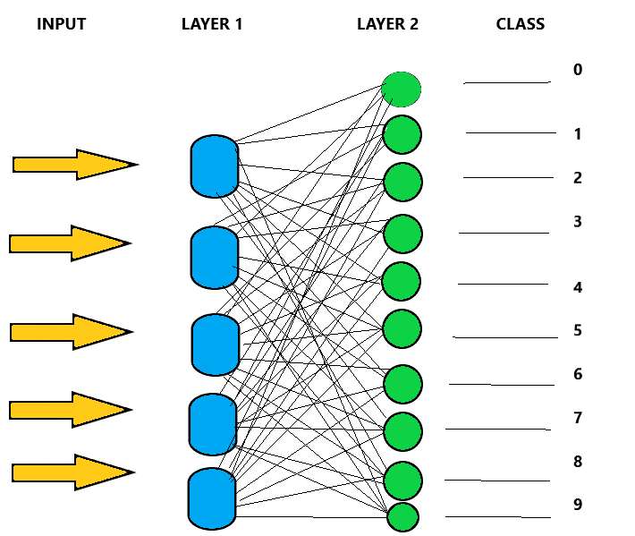

4th Year Emerging Technologies Project consists of the well-know MNIST dataset as well as python packages like keras Flask and jupyter.The appliaction being developed is a model that will distinguish hand written digit's using the MNIST dataset and also a web Application that will let the user draw digit's using the mouse

## MODEL Research

The MNIST dataset comes preloaded in keras
this input data will consist of grayscale images represented by 28 by 28 pixel matrix.
Each pixel value is a unsigned 8 bit Integerin the range of 0 to 255

We get the training data and the testing data along with the corresponding label's and then we call the load data method.
For Our Model we will need layers, layers are the building blocks for Keras.2 layers will be added in my model

